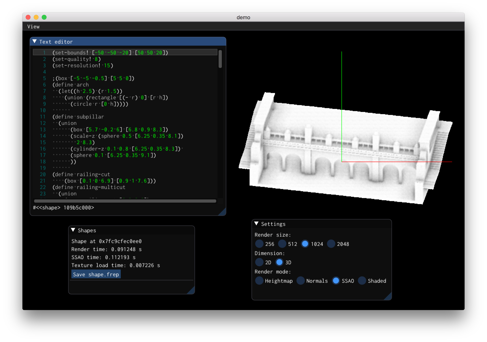

# `mpr`
This is the reference implementation for
"Massively Parallel Rendering of Complex Closed-Form Implicit Surfaces",
a technical paper which will be presented (virtually) at SIGGRAPH 2020.

It builds on [`libfive`](https://libfive.com),
which is included as a submodule.

## Major components
### `mpr::Tape`
The `Tape` constructor takes a `libfive::Tree` object,
flattens it,
assigns slots,
and packs it into a set of `uint64_t` clauses in GPU RAM.

This is described in Section 2 of the paper.

### `mpr::Context`
The `Context` class is responsible for actually rendering tapes on the GPU.
In particular `Context::render2D` implements Alg. 3 from the paper,
and `Context::render3D` implements the 3D rendering discussed in Section 4.2

The `eval_tiles_i` kernel in `context.cu`
implements Algorithms 1 and 2 from the paper.

### `mpr::Effects`
This `struct` applies various post-processing effects
on images rendered by a `Context`.
Effects are limited to shading and screen-space ambient occlusion (SSAO).

This part of the code isn't as well tuned as the rest,
because it's not a core part of the algorithm.

### GUI
The GUI is an extremely basic tool for testing out the implementation.



It is based on [Dear ImGui](https://github.com/ocornut/imgui)
and uses [ImGuiColorTextEdit](https://github.com/BalazsJako/ImGuiColorTextEdit)
as a text editor.

## Reproducing our results on AWS
You can reproduce the results in the paper for about $5 on AWS!

First, make sure that your AWS account has permission to create a `p3.2xlarge` instance.
New accounts don't, so I had to email support and ask for an
[increase in my vCPU limits](https://console.aws.amazon.com/servicequotas/home?region=us-east-1#!/dashboard).

Keep in mind, this instance costs $3.06/hour,
so you'll want to be very careful about **turning it off when not benchmarking**;
leaving it on for a month will cost you a cool **$2276**.

Once you've gotten permission to create the instance,
spin up an server with the latest version of
`Deep Learning Base AMI (Ubuntu 18.04)`.
I used `Version 21.0 (ami-0b98d7f73c7d1bb71)`, but you should use the most recent release.

SSH into the server and run a bunch of commands:
```
# Install dependencies
sudo apt install mesa-common-dev ninja-build

# Install a recent version of eigen
wget https://gitlab.com/libeigen/eigen/-/archive/3.3.7/eigen-3.3.7.tar.gz
tar -zxvf eigen-3.3.7.tar.gz
cd eigen-3.3.7
mkdir build
cd build
cmake ..
sudo make install

# Install `mpr`
cd
git clone git@github.com:mkeeter/mpr
cd mpr
git submodule update --init --recursive
mkdir build
cd build
cmake -GNinja -DBIG_SERVER=ON ..
ninja
```

At this point,
you can reproduce the benchmarks in the paper by running `../run_benchmarks.sh`
(from the `build` directory).
This will print a bunch of performance values, starting with

```
============================================================
                      2D benchmarks
============================================================
Text benchmark
256 5.29331 0.261052
512 4.21138 0.00523862
1024 3.85596 0.00625019
...
```
The three columns are size,
frame time (in milliseconds),
and standard deviation.

The benchmarking script will save the output images
into a subfolder for each model:
```
prospero
gears_2d
architecture
gears_3d
bear
```

Remember to **turn off the server when you're done**.

## Building on MacOS
Install [Homebrew](https://brew.sh) and [CUDA](https://docs.nvidia.com/cuda/cuda-installation-guide-mac-os-x/index.html),
then run something like
```
brew install cmake pkg-config eigen libpng qt guile boost ninja
git clone git@github.com:mkeeter/mpr
cd mpr
git submodule update --init --recursive
mkdir build
cd build
env CUDACXX=/usr/local/cuda/bin/nvcc cmake -GNinja ..
ninja
```

## Disclaimer
This is research code,
without institutional or commercial backing.

I'll provide best-effort support
for running on AWS in the configuration described above.

Otherwise, if you encounter issues,
please consider debugging independently
and opening a PR with your fixes;
I can't guarantee that I'll address your issues myself.
